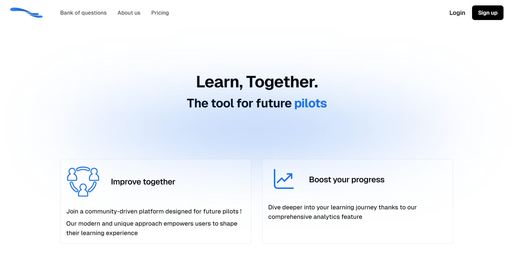
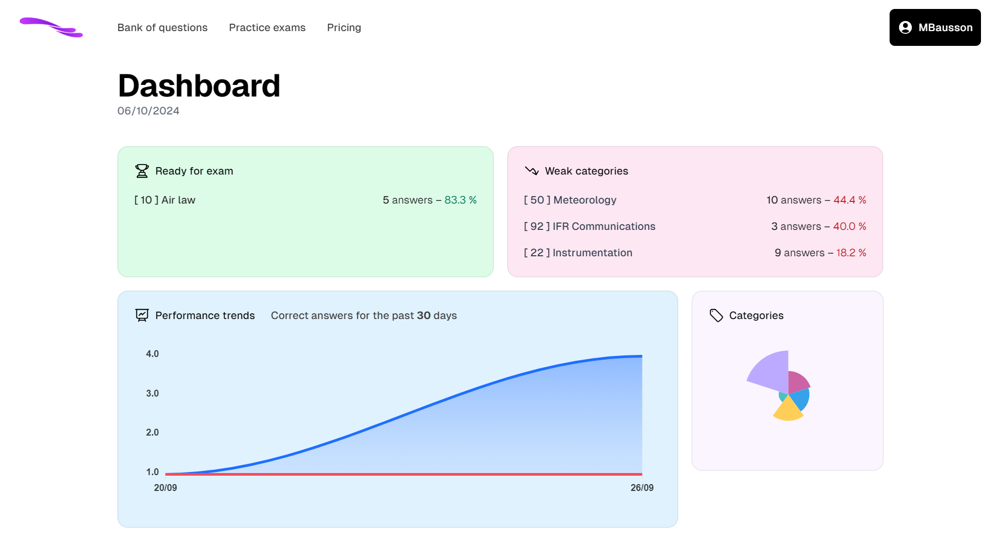
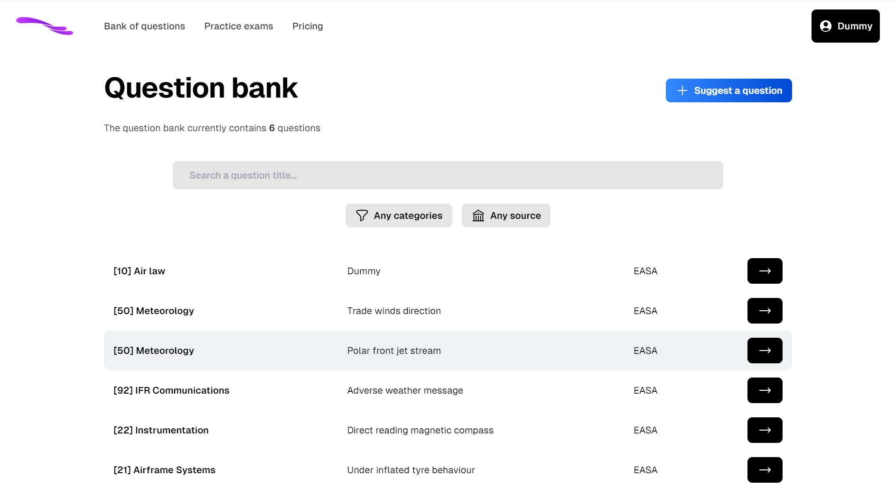
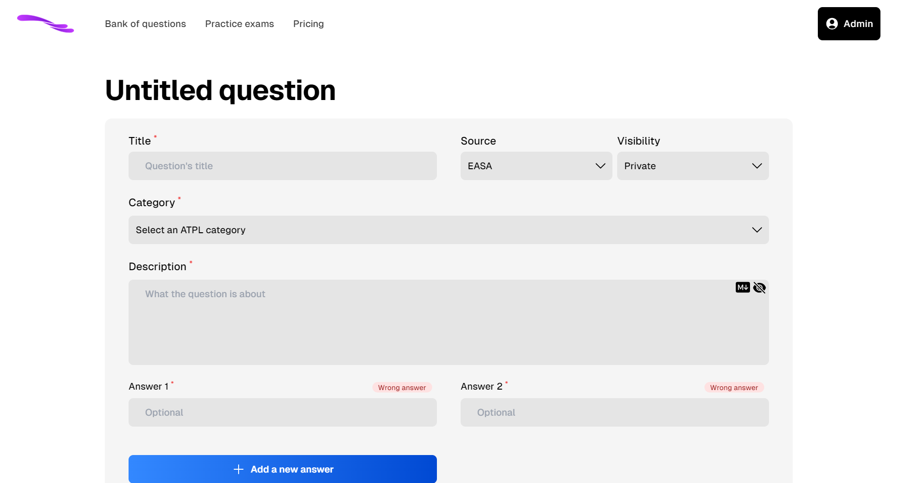
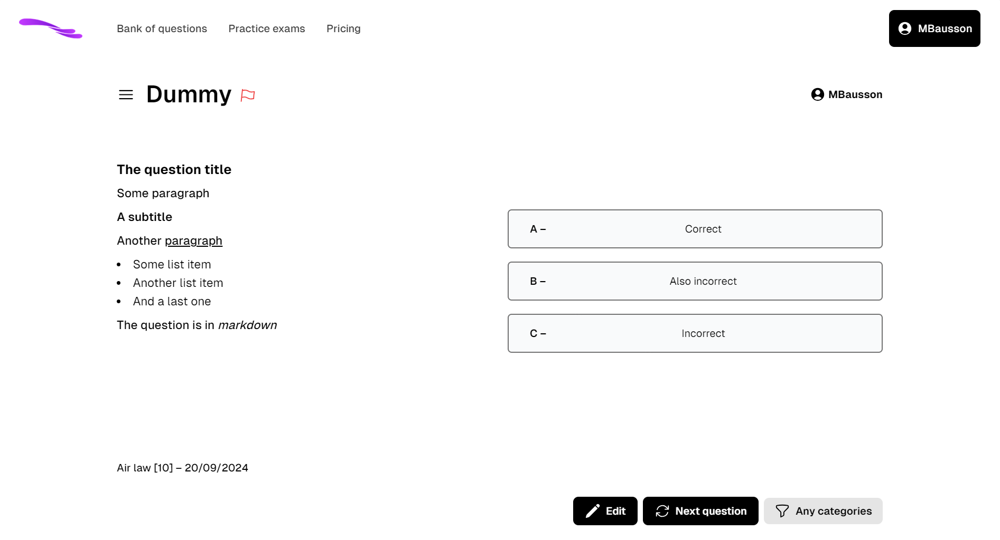

# Aviask

## Disclaimers

**⚠️ This project is not used in production, and was primarily developped for education purposes. If you wish to deploy it, please adapt the brand name.**

⚠️ This repository is a **snapshot** of one of my private repository, with areas for improvements.

## Demo video

[Demo video](https://github.com/MBausson/Aviask/raw/refs/heads/master/image/README/video-demo.mp4)

## Project and features

Aviask is an **ATPL questions bank** website, that focuses on community engagement.

Here is a list of some of the features implemented:

- Users can report (or give feedback to) questions.
- Users can submit questions, which have to be validated by the staff.
- Markdown field for questions, with sanitization.
- Mock exams : users are put closer to real conditions of ATPL exams.
- Monthly subscription to fully enjoy the features of Aviask.
  - Non-premium users have access to a limited set of questions. This set is reset every few days.
- Dashboard with interesting information for learners
- Dark/light mode, with auto-detection
- (Disabled by default) Leaderboard : ranks the user who contribute the most to the question bank
- ...

## Technologies used

This project uses VueJS with Typescript for the front-end part.

For the backend, I've used ASP.NET Web API. The authentication is made via a JWT, and Postgres is used for the database.

Stripe was used for the subscriptions, but another provider can easily be changed.

## Run the project

First, fill-in your `.env` files according to the `.env.dist` files in the Web & Api directories.

If ran for the first time, the API _should_ automatically run the pending migrations.

#### Locally

When developping, run these commands in two seperate terminals:

```bash
# In ./AviaskWeb
npm run dev

# In ./AviaskApi
dotnet run --launch-profile https
```

#### Deploy the application

The project comes with a `docker-compose.yml` file, allowing you to deploy both front & back instances:

```bash
# At project root directory
docker compose up --build
```

#### Run the tests

This project uses `XUnit` with the `TestContainers` library to mock a database. For the tests to run, please ensure you have the **docker daemon** running.

```bash
# In ./AviaskApiTest
dotnet test
```

## Screenshots

_The home page of Aviask_



_Dashboard of a connected user_



_Question list_



_Question form (create)_



_Question_


